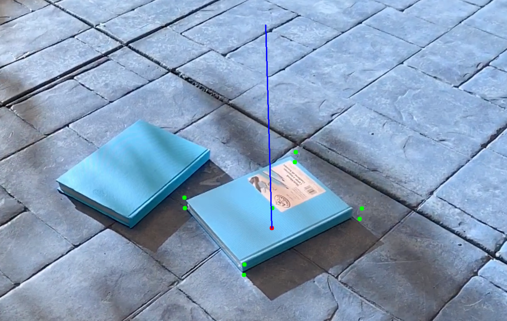

# GroundNet
 Low-energy ground plane estimation from image differences in video

The goal of this project is to estimate the ground plane normal using motion in video similar to how performed by: https://arxiv.org/pdf/1811.07222v4.pdf
This work tries to condense the previous work to only handle ground plane estimations.

Here is an example of a desired estimation. Given a scene, we want to find the blue vector:

The model is trained using the objectron dataset, as I found other existing ground-plane datasets to be very automotive-focused. Flat objects estimate the ground vector very well, so hopefully, we can have more generalizeable results from this.

The idea is to first make a working CNN for this problem, and then if it works try to apply the same data to an SNN. This could allow for sparse ground estimations on-edge for applications such as AR.